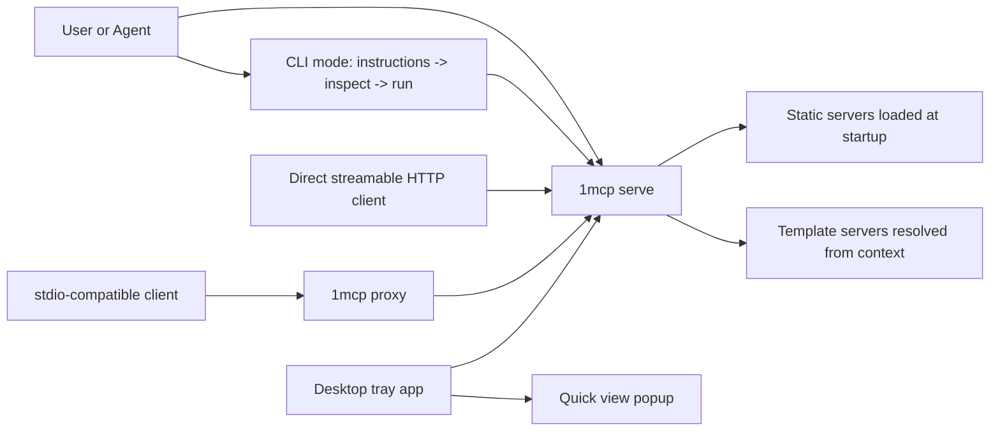

# 1MCP Plus

[](LICENSE)
[](https://github.com/lucgray/1mcp-plus/stargazers)
[](https://github.com/1mcp-app/agent)
[](https://docs.1mcp.app)

**1MCP Plus** is a community fork of [1MCP](https://github.com/1mcp-app/agent), the unified MCP runtime that aggregates many MCP servers behind a single endpoint. On top of the upstream runtime, this fork ships a **desktop application with a system-tray quick view** for operating and monitoring the server.

> [!WARNING]
> **使用注意 / Read this first**
>
> This fork is written and maintained by AI (Devin). It is a "vibe-coded" side project: the changes on top of upstream have **not** been through upstream's review process and are not audited, signed, or officially released. Do not use it for anything you cannot afford to debug. If you need a supported build, use [1mcp-app/agent](https://github.com/1mcp-app/agent) directly.
>
> 本仓库为 AI（Devin）生成与维护的 fork，属于纯 vibe 产物：上游之上的改动未经过上游评审，没有审计或正式签名发布。请勿用于关键环境；需要受支持的版本请直接使用上游 [1mcp-app/agent](https://github.com/1mcp-app/agent)。

## What this fork adds

| Feature                   | Description                                                                                                                                                                                                        |
| ------------------------- | ------------------------------------------------------------------------------------------------------------------------------------------------------------------------------------------------------------------ |
| Desktop app (`desktop/`)  | Electron shell that manages a `1mcp serve` runtime — starts it automatically, reuses the embedded Node runtime (no system Node required), and opens the built-in `/admin` console in a native window.              |
| Tray quick view           | System-tray icon with a live status menu and a click-to-open popup: server state, endpoint, version, uptime, per-MCP-server readiness (`ready` / `loading` / `failed` / `oauth`), and recent log lines on failure. |
| Windows reliability fixes | Longer budgets for process-identity inspection and schema compilation, and retryable schema timeouts now surface as HTTP 503 instead of HTTP 500 (upstream issue #564).                                            |
| Conformance fix           | Era-aware classification for modern MCP probes (ported from upstream PR #557, issue #553).                                                                                                                         |

Everything else — the `1mcp` CLI, `serve` runtime, `proxy`, transports, and admin console — is upstream 1MCP, forked at release v0.38.2.

## What 1MCP is

Most MCP setups eventually hit two kinds of sprawl:

- **Configuration sprawl**: every client needs its own MCP wiring, auth choices, and filtering rules.
- **Agent sprawl**: autonomous sessions carry too many tools and schemas into context up front.

1MCP addresses both:

- `1mcp serve` gives you one aggregated runtime in front of many MCP servers.
- CLI mode lets agents discover tools progressively with `instructions`, `inspect`, and `run`.
- Static servers load at startup; template servers are created from per-client or per-session context.
- Presets, filters, and instruction aggregation keep the same runtime adaptable across clients and projects.

## Quick start

### Runtime only (from source)

```bash
git clone https://github.com/lucgray/1mcp-plus.git
cd 1mcp-plus
pnpm install
pnpm build

node build/index.js mcp add context7 -- npx -y @upstash/context7-mcp
node build/index.js serve
```

Then point an MCP client at `http://127.0.0.1:3050/mcp`, or use the stdio proxy:

```bash
node build/index.js proxy
```

### Desktop app (tray + quick view)

```bash
pnpm build                 # build the runtime bundle first
cd desktop
npm install
npm run dev                # compiles and launches Electron
```

The app spawns `1mcp serve` on `127.0.0.1:3050`, shows a tray icon, and opens a quick-view popup on click. Environment knobs: `ONE_MCP_DESKTOP_PORT` (default `3050`), `ONE_MCP_DESKTOP_AUTOSTART` (default `1`), `ONE_MCP_DESKTOP_SERVER_ENTRY` (override the server entrypoint). See [`desktop/README.md`](desktop/README.md) for packaging (`AppImage`, `NSIS`) and entry-resolution details.

## How it works



## Upstream documentation

The full user and operator documentation lives upstream — it applies to this fork's runtime verbatim:

- [Quick start guide](https://docs.1mcp.app/guide/quick-start)
- [Configuration](https://docs.1mcp.app/guide/essentials/configuration)
- [Authentication](https://docs.1mcp.app/guide/advanced/authentication)
- [Architecture](https://docs.1mcp.app/reference/architecture)

## Relationship to upstream

- This repo was forked from [`1mcp-app/agent`](https://github.com/1mcp-app/agent) at release **v0.38.2**; all credit for the runtime goes to the upstream maintainers.
- Changes that make sense upstream may be contributed back as PRs; this fork is not a hostile split.
- Issues and PRs in this repository cover **fork-specific work** (desktop app, fork patches). Please report upstream bugs at [1mcp-app/agent](https://github.com/1mcp-app/agent/issues).

## License

Apache 2.0 — see [LICENSE](LICENSE). Upstream code remains © the 1MCP authors; fork additions are licensed identically.
